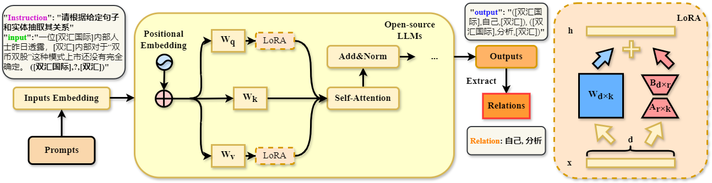

# CRE-LLM
<h4 >CRE-LLM: A Domain-Specific Chinese Relation Extraction Framework with Fine-tuned Large Language Model</h4>

[](https://arxiv.org/abs/2310.08975)

\[ English | [中文](README_zh.md) \]

##  Overview 



## Supported Models

| Model                                                    | Model size                  | Default module    | Template  |
| -------------------------------------------------------- | --------------------------- | ----------------- | --------- |
| [LLaMA-2](https://huggingface.co/meta-llama)             | 7B/13B/70B                  | q_proj,v_proj     | llama2    |
| [Baichuan2](https://github.com/baichuan-inc/Baichuan2)   | 7B/13B                      | W_pack            | baichuan2 |
| [ChatGLM2](https://github.com/THUDM/ChatGLM2-6B)         | 6B                          | query_key_value   | chatglm2  |

## Requirement

- Python 3.8+ and PyTorch 1.13.1+
- 🤗Transformers, Datasets, Accelerate, PEFT and TRL
- sentencepiece, protobuf and tiktoken

And **powerful GPUs**!

## Getting Started

### Dependence Installation

```bash
git clone https://github.com/SkyuForever/CRE-LLM.git
conda create -n CRE-LLM python=3.10
conda activate CRE-LLM
cd CRE-LLM
pip install torch==1.13.1+cu117 torchvision==0.14.1+cu117 torchaudio==0.13.1 --extra-index-url https://download.pytorch.org/whl/cu117
pip install -r requirements.txt
```

## Data Preparation (optional)

Experiments are conducted on 2 CRE benchmarks FinRE, SanWen.

### FinRE

[FinRE](https://www.microsoft.com/en-us/research/publication/the-value-of-semantic-parse-labeling-for-knowledge-base-question-answering-2/) dataset has been downloaded under `data/FinRE`.

```
CRE-LLM/
└── data/
    ├── FinRE                  
        ├── train.json
        ├── valid.txt      
        ├── test.txt
        └── relation2id.txt                                                           
```

### SanWen

[SanWen](https://www.dropbox.com/sh/7pkwkrfnwqhsnpo/AACuu4v3YNkhirzBOeeaHYala) dataset has been downloaded under `data/SanWen`.
```
CRE-LLM/
└── data/
    ├── SanWen                 
        ├── train.txt                   
        ├── valid.txt      
        ├── test.txt
        └── relation2id.txt                       
```

## Data Processing (optional)

**Prepare data for training and evaluation** 

- FinRE: 

Run `python parse_sparql_webqsp.py` and the augmented dataset files are saved as `data/FinRE/test[train].json`. 

- SanWen 

Run `python parse_sparql_cwq.py` and the augmented dataset files are saved as `data/SanWen/test[train].json`.

> [!NOTE]
> Please update `data/dataset_info.json` to use your custom dataset. About the format of this file, please refer to `data/README.md`.
>
> You can also get the CRE-LLM processed data from our project directly, which should be set in `data/`.
```
CRE-LLM/
└── data/
    ├── FinRE/                 
        ├── train.json    
        ├── valid.json
        └── test.json  
    └── SanWen/                 
        ├── train.json    
        ├── valid.json
        └── test.json                                               
```

## Fine-tuning and Evaluation

The following is an example of [LLaMa2-7b](README.md) fine-tuning on FinRE and CWQ, respectively. We also provide a variety of LLMs (including [LLaMa2-7b](scripts/README_LLaMa2-7b.md), [LLaMa2-13b](scripts/README_LLaMa2-13b.md), [ChatGLM2-6b](scripts/README_ChatGLM2-6b.md), [Baichuan2-7b](scripts/README_Baichuan2-7b.md), [Baichuan2-13b](scripts/README_Baichuan2-13b.md)) fine-tuning scripts (num_beam = 8).

(1) **Supervised Fine-Tuning LLM for triple Generation**

- FinRE: 

Train LLMs for triple Generation:

```bash
CUDA_VISIBLE_DEVICES=0 nohup python src/train_bash.py --model_name_or_path path_to_model --stage sft --do_train --dataset FinRE --template default --finetuning_type lora --lora_target q_proj,v_proj --output_dir path_to_sft_checkpoint --overwrite_cache --per_device_train_batch_size 4 --gradient_accumulation_steps 4 --lr_scheduler_type cosine --logging_steps 10 --save_steps 1000 --learning_rate 5e-5 --num_train_epochs 5 --plot_loss --fp16 >> FinRE_train.txt 2>&1 &
```

Test LLMs for triple Generation:
```bash
CUDA_VISIBLE_DEVICES=3 nohup python -u src/train_bash.py --model_name_or_path path_to_model --stage sft --dataset FinRE --do_predict --template default --finetuning_type lora --checkpoint_dir path_to_checkpoint --output_dir path_to_predict_result --per_device_eval_batch_size 8 --max_samples 100 --predict_with_generate >> FinRE_test.txt 2>&1 &
```

- SanWen:

Train LLMs for triple Generation:

```bash
CUDA_VISIBLE_DEVICES=0 nohup python src/train_bash.py --model_name_or_path path_to_model --stage sft --do_train --dataset SanWen --template default --finetuning_type lora --lora_target q_proj,v_proj --output_dir path_to_sft_checkpoint --overwrite_cache --per_device_train_batch_size 4 --gradient_accumulation_steps 4 --lr_scheduler_type cosine --logging_steps 10 --save_steps 1000 --learning_rate 5e-4 --num_train_epochs 10 --plot_loss --fp16 >> SanWen_train.txt 2>&1 &
```

Test LLMs for triple Generation:
```bash
CUDA_VISIBLE_DEVICES=3 nohup python -u src/train_bash.py --model_name_or_path path_to_model --stage sft --dataset SanWen --do_predict --template default --finetuning_type lora --checkpoint_dir path_to_checkpoint --output_dir path_to_predict_result --per_device_eval_batch_size 8 --max_samples 100 --predict_with_generate >> SanWen_test.txt 2>&1 &
```

(2) **Evaulate CRE result**

- FinRE: 

Run `python parse_sparql_webqsp.py` and the augmented dataset files are saved as `data/FinRE/test[train].json`. 


## Citation

If this work is helpful for you, please kindly cite as:

```bibtex

```

## Acknowledgement

This repo benefits from [PEFT](https://github.com/huggingface/peft), [LLaMA-Efficient-Tuning](https://github.com/hiyouga/LLaMA-Efficient-Tuning), [SimCSE](https://github.com/princeton-nlp/SimCSE) and [DECAF](https://github.com/awslabs/decode-answer-logical-form). Thanks for their wonderful works.

